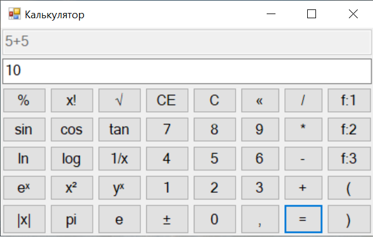
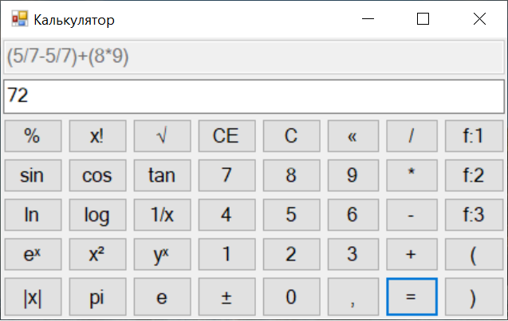
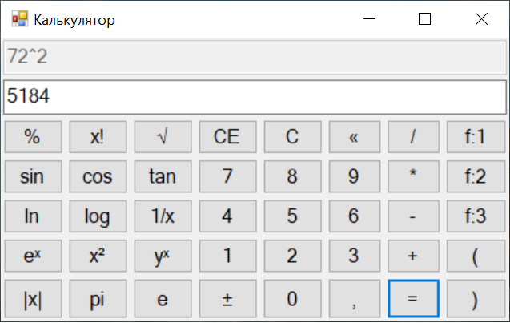
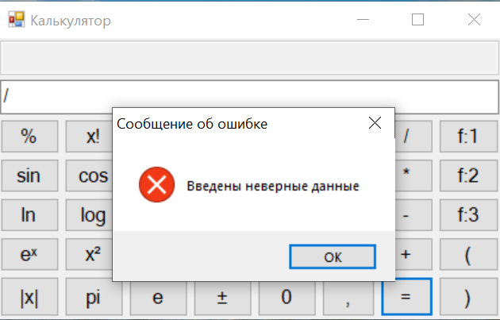
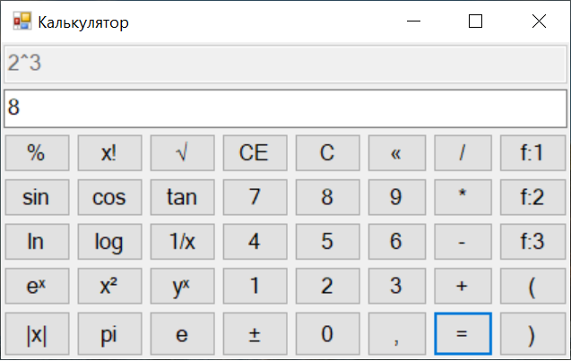

# Calculator-WinForms
It's a calculator written on C#. I was using delegates, events, stacks. Also I was trying to observe object-oriented programming principles.
By the way unit tests was created for this project.

A little additional information for using this application: 

1) Buttons f:1, f:2, f:3 means rounding to the suitable numbers after the decimal point of real numbers.

2) sin, cos, module and other unary operations work only for 1 number in line.

3) The algorithm was taken from the video on link https://www.youtube.com/watch?v=Vk-tGND2bfc&t=76s

